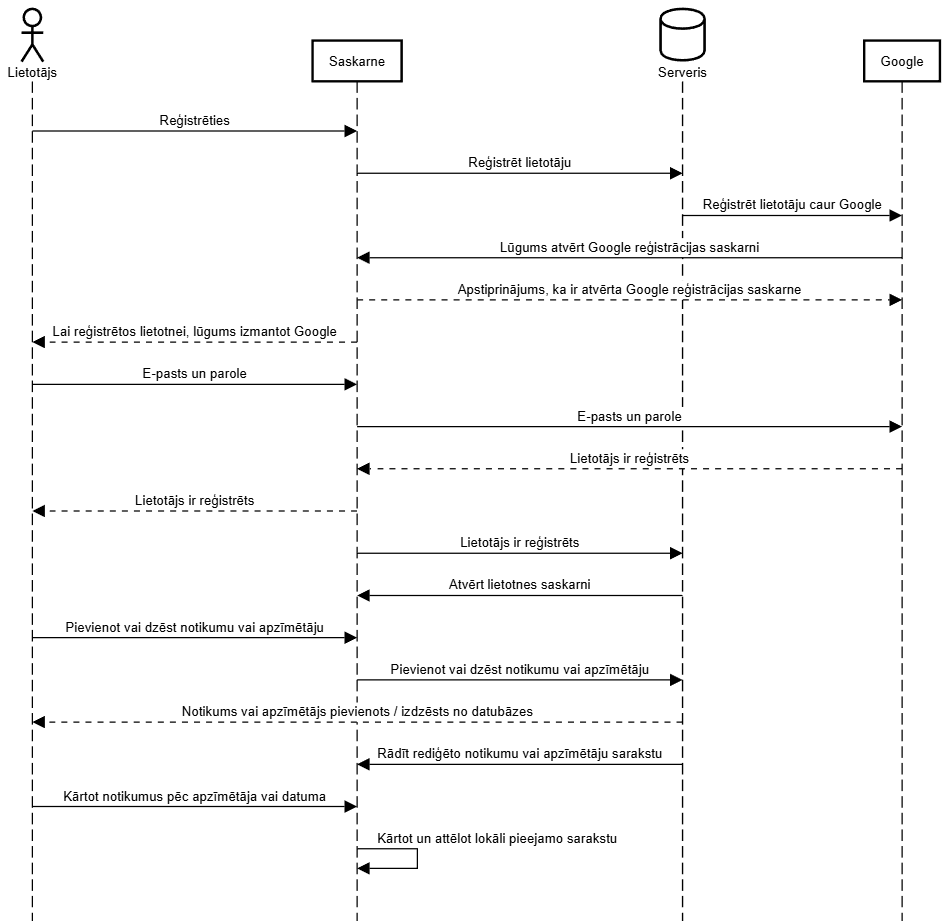

| **Vārds** | **Uzvārds** |
|:---------:|:-----------:|
|  Mārcis   | Aizpurietis |
|  Roberts  |    Smila    |

| **Formāts:** | Mobilā (tīkla) lietotne |
|--------------|-----------------------|

## Apraksts

Mācības skolā un paralēlas aktivitātes nozīmē lielu daudzumu darbu un uzdevumu, kam jāatvēl un jāieplāno laiks. Lai šiem darbiem varētu vienkārši izsekot, mēs plānojam izstrādāt plānotāja web-aplikāciju ar parocīgām funkcijām.
Plānotājs būtu pieejams no interneta pārlūka, lietotājam pieslēzoties ar lietotājvārdu un paroli. Tas ļautu lietotājam pievienot “notikumus” ar noteiktu datumu, “apzīmētāju” un aprakstu. Galvenokārt visus “notikumus” būtu iespējams aplūkot secīgi pēc to datumiem, bet, ja datuma aile tiktu atstāta tukša, “notikums” tiktu attēlots atsevišķi no pārējā saraksta, kā uzdevums, kas veicams steidzami / neatkarīgi no datuma. Izvēloties “apzīmētāju” lietotājam būtu opcija izveidot jaunu “apzīmētāju” vai izvēlēties kādu no esošajiem, iepriekš izgatavotajiem “apzīmētājiem”. “Notikuma” “apzīmētājs” norādā, kādā kategorijā “notikums” ietilpst, un sastāvētu no teksta un vienas krāsas atvieglotai atpazīstamībai, kā, piemēram, 🔴Pārbaudes darbs vai 🔵Tikšanās. Lietotājam tiktu dota iespēja “filtrēt” notikumus pēc to “apzīmētājiem”, lai redzētu tikai tuvākos pārbaudes darbus vai tuvākās tikšanās, kā jau minēts, datumu secībā. Visbeidzot “notikumus” būtu iespējams noņemt no saraksta vai nu manuāli, vai arī sagaidot, kad atzīmētais datums būs pagājis. Noņemtie “notikumi” tiktu novietoti atsevišķā sarakstā - atkritnē / arhīvā -, kas lietotājam arī būtu pieejams.
Iespējamas papild-funkcijas, kas nav daļa no galvenā plāna / primārās plānotāja idejas:
Prioritātes iestatījums katram “notikumam” (cik tas ir svarīgs) vai kāds cits veids, kā lietotājam manuāli sakārtot pagaidu sarakstu, kurā norādīts, kas jādara pirmais un kas var uzgaidīt.
Opcija rādīt / slēpt tukšās kalendāra dienas starp “notikumiem”, lai ļautu lietotājam labāk vizualizēt pieejamo laiku starp “notikumiem”.
Rādīt nedēļas dienu (pirmdiena, otrdiena, trešdiena…) blakus datumam.
Iespēja saskaņot plānus ar citiem litotājiem, automātiski salīdzinot, kuras dienas ir brīvas un kuras aizņemtas, kā arī, iespējams, ņemot vērā “notikumu” prioritātes, lai atrastu dienu, kurā abi / visi varētu satikties vai kaut ko kopā iesākt.
Iespēja pieslēgties plānotājam no aplikācijas uz mobilās ierīces.

## Darba plāns

| **Izmantotās tehnoloģijas** |
|:----------------------------|
| REACT                       |
| NODEJS                      |
| WebStorm                    |
| MySQL?                      |
| Docker?                     |


| **Konceptuālais modelis:** |  |
|:--------------------------:|:-------------------------------------------------|

| **Nedēļa** |   **Datums**    | **Uzdevums**                                                                                                               | **Darītājs** |
|:----------:|:---------------:|:---------------------------------------------------------------------------------------------------------------------------|:------------:|
|     #1     | 02.02. - 08.02. | Iepazīties ar izmantotajām tehnoloģijām, izveidojot vienkāršu komunikācijas ķēdi starp visiem iesaistītajiem dalībniekiem. |    Mārcis    |
|     #1     | 02.02. - 08.02. | Iepazīties ar izmantotajām tehnoloģijām, izveidojot vienkāršu komunikācijas ķēdi starp visiem iesaistītajiem dalībniekiem. |   Roberts    |
|     #2     | 09.02. - 15.02. | Izstrādāt vienkāršu saskarni, laika līnijas un aktuālo notikumu ailes vizuālo uzmetumu.                                    |    Mārcis    |
|     #2     | 09.02. - 15.02. | Izstrādāt vienkāršu saskarni, laika līnijas un aktuālo notikumu ailes vizuālo uzmetumu.                                    |   Roberts    |
|     #3     | 16.02. - 22.02. | Pievienot filtru un funkciju paneļa vizuālo uzmetumu.                                                                      |    Mārcis    |
|     #3     | 16.02. - 22.02. | Pievienot filtru un funkciju paneļa vizuālo uzmetumu.                                                                      |   Roberts    |
|     #4     | 23.02. - 01.03. | Izstrādāt notikumu pievienošanas un izdzēšanas funkciju, neiekļaujot apzīmētājus.                                          |    Mārcis    |
|     #4     | 23.02. - 01.03. | Izstrādāt notikumu pievienošanas un izdzēšanas funkciju, neiekļaujot apzīmētājus.                                          |   Roberts    |
|     #5     | 02.03. - 08.03. | Izstrādāt apzīmētāju pievienošanas un izdzēšanas funkciju.                                                                 |    Mārcis    |
|     #5     | 02.03. - 08.03. | Izstrādāt apzīmētāju pievienošanas un izdzēšanas funkciju.                                                                 |   Roberts    |
|     #6     | 09.03. - 15.03. | Pievienot apzīmētājus notikumu pievienošanas funkcijai.                                                                    |    Mārcis    |
|     #6     | 09.03. - 15.03. | Pievienot apzīmētājus notikumu pievienošanas funkcijai.                                                                    |   Roberts    |
|     #7     | 16.03. - 22.03. | Izstrādāt notikumu filtrēšanas funkciju pēc datuma un apzīmētāja.                                                          |    Mārcis    |
|     #7     | 16.03. - 22.03. | Izstrādāt notikumu filtrēšanas funkciju pēc datuma un apzīmētāja.                                                          |   Roberts    |
|     #8     | 23.03. - 29.03. | Izstrādāt reģistrācijas saskarni.                                                                                          |    Mārcis    |
|     #8     | 23.03. - 29.03. | Izstrādāt reģistrācijas saskarni.                                                                                          |   Roberts    |
|     #9     | 30.03. - 05.04. | Pievienot Google reģistrāciju / autentifikāciju.                                                                           |    Mārcis    |
|     #9     | 30.03. - 05.04. | Pievienot Google reģistrāciju / autentifikāciju.                                                                           |   Roberts    |
|    #10     | 06.04. - 12.04. | Pielāgot saskarni mobilajām ierīcēm.                                                                                       |    Mārcis    |
|    #10     | 06.04. - 12.04. | Pielāgot saskarni mobilajām ierīcēm.                                                                                       |   Roberts    |
|    #11     | 13.04. - 19.04. | "Noslīpēt" lietotni veicot smalkas vizuālās izmaiņas saskarnē, lai to padarītu ērtāku lietošanai.                          |    Mārcis    |
|    #11     | 13.04. - 19.04. | "Noslīpēt" lietotni veicot smalkas vizuālās izmaiņas saskarnē, lai to padarītu ērtāku lietošanai.                          |   Roberts    |
|    #12     | 20.04. - 26.04. | Iespējot lietotnes atvēršanu no mobilajām ierīcēm, kā tīkla aplikāciju.                                                    |    Mārcis    |
|    #12     | 20.04. - 26.04. | Iespējot lietotnes atvēršanu no mobilajām ierīcēm, kā tīkla aplikāciju.                                                    |   Roberts    |
|    #13     | 27.04. - 03.05. | Veikt testēšanu, izdalot lietotni lietotājiem, veicot uzlabojumus un labojot kļūdas, ja nepieciešams.                      |    Mārcis    |
|    #13     | 27.04. - 03.05. | Veikt testēšanu, izdalot lietotni lietotājiem, veicot uzlabojumus un labojot kļūdas, ja nepieciešams.                      |   Roberts    |
|    #14     | 04.05. - 08.05. | Prezentēt lietotni.                                                                                                        |    Mārcis    |
|    #14     | 04.05. - 08.05. | Prezentēt lietotni.      <br/>                                                                                                  |   Roberts    |


## Instrukcijas lietotnes izmantošanai un testēšanai

Lai palaistu aplikāciju ir nepieciešams ielādēt docker desktop.
Klonē projektu no GitHub.
Kad tas ir izdarīts, tad terminali raksti: "docker build -t planner-app ."
Tad raksti: "docker run -p 3000:3000 --name planner planner-app"
Tad: "docker start -a planner"
Ja vēlies, lai visi dati saglabājas lokāli pēc restartēšanas, tad ar Windows raksti šo:
"docker run -p 3000:3000 --name planner -v %cd%:/app planner-app"
Bet ja ar Mac vai Linux, tad šādi:
"docker run -p 3000:3000 --name planner -v $(pwd):/app planner-app"
Ja vēlies, lai serveris strada tikai fona, tad pietiek "docker start -a planner" vietā var "docker start planner"

# TESTĒŠANAS PĀRSKATS

## FUNKCIONĀLIE TESTI

| Nr. | Tests | Testa apraksts | Ievade / darbība | Sagaidāmais rezultāts | Patiesais rezultāts |
|---|---|---|---|---|---|
| 1 | Funkcionālais tests | Izmantojot pogu "Pievienot", pārbaudīt, vai pievienotais uzdevums parādās uzdevumu sarakstā. | Ievadīts nosaukums, derīgs datums, apraksts un tags. | Uzdevums parādās uzdevumu sarakstā. | Uzdevums parādās uzdevumu sarakstā un to ir iespējams redzēt. |
| 2 | Funkcionālais tests | Izmantojot pogu "Pievienot", pārbaudīt, vai šodienas uzdevums parādās šodienas uzdevumu sarakstā. | Ievadīts nosaukums, šodienas datums, apraksts un tags. | Uzdevums parādās šodienas uzdevumu sarakstā. | Uzdevums veiksmīgi parādās šodienas uzdevumu sarakstā un ir redzams logā. |
| 3 | Funkcionālais tests | Izmantojot pogu "Pievienot", pārbaudīt, kas notiek, ievadot nederīgu datumu. | Ievadīts nosaukums, nederīgs datums, apraksts un tags. | Ja datums neeksistē, bet ir mazāks par 32, tas tiek pārcelts uz nākamo mēnesi ar derīgu datumu. Piemēram, 31/02/2026 tiek pārvērsts par 03/03/2026. Ja datums ir lielāks par 32, uzdevums tiek pārvietots uz bezdatuma konteineri. | Ja datums neeksistē un ir mazāks par 32, tad datums tiek pārcelts uz nākamo mēnesi ar derīgu datumu. Ja datums ir lielāks par 32, uzdevums tiek pārlikts uz bez datuma konteineri. |
| 4 | Funkcionālais tests | Izmantojot pogu "Pievienot", pārbaudīt, vai pagātnes uzdevums parādās uzdevumu sarakstā ar pagātnes krāsas indikatoru. | Ievadīts nosaukums, pagātnes datums, apraksts un tags. | Uzdevums parādās uzdevumu sarakstā ar pelēku pagātnes krāsas indikatoru. | Uzdevums veiksmīgi parādās uzdevumu sarakstā un ir redzams logā ar pelēko pagātnes uzdevuma indikācijas krāsu. |
| 5 | Funkcionālais tests | Izmantojot pogu "Pievienot", pārbaudīt, vai nākotnes uzdevums parādās uzdevumu sarakstā ar nākotnes uzdevuma indikatoru. | Ievadīts nosaukums, nākotnes datums, apraksts un tags. | Uzdevums parādās uzdevumu sarakstā ar zilu krāsas indikatoru. | Uzdevums veiksmīgi parādās uzdevumu sarakstā ar sagaidīto indikatoru un ir redzams logā. |
| 6 | Funkcionālais tests | Pārbaudīt, vai, izmantojot pogu "Dzēst", tiek dzēsts dotais uzdevums un saraksta numerācija izmainās atbilstoši. | Uzspiež pogu "Dzēst" un izdzēš ierakstos uzdevuma numuru. | Uzdevums tiek dzēsts no uzdevumu saraksta, vairs netiek rādīts logā, un numerācija izmainās atbilstoši. | Uzdevums tiek dzēsts un vairs nekur nav redzams, bet numerācija sarakstā, kas tiek parādīts, uzspiežot pogu "Dzēst", nemainās atbilstoši. |
| 7 | Funkcionālais tests | Izmantojot pogu "Rediģēt", izmainīt uzdevuma parametrus un novērot, vai tie atbilstoši mainās. | Uzspiežot pogu "Rediģēt", izvēlas mainīt datumu un ievada šodienas datumu. | Uzdevums maina krāsu uz dzeltenu, parādot, ka tas ir šodienas uzdevums. | Uzdevums atbilstoši maina krāsu un datumu, un ir redzams uzdevumu logā. |
| 8 | Funkcionālais tests | Izmantojot pogu "Filtrēt", pārbaudīt visas komandas, kas ir pieejamas filtrēšanai. | Ievadīt "Skolas darbi", "Ārpus skolas darbi" un "Rādīt visus". | Atbilstoši ievadītajam tiek parādīti uzdevumi ar iepriekš aprakstītajiem tagiem. | Ierakstot doto opciju filtrēšanai, uzdevumu logā parādās atbilstošie uzdevumi. |

## NEFUNKCIONĀLIE TESTI

| Nr. | Tests | Testa apraksts | Ievade / darbība | Sagaidāmais rezultāts | Patiesais rezultāts |
|---|---|---|---|---|---|
| 1 | Nefunkcionālais tests | Pievienojot uzdevumus, pārbaudīt to redzamību. | Tiek pievienots uzdevums ar nosaukumu. | Uzdevums ir redzams uzdevumu logā un nav vizuāli grūti to saskatīt. | Uzdevums parādās uzdevumu logā, bet to ir sarežģīti redzēt. Labāk to iespējams saskatīt tikai atverot inspect izvēlni ar F12. |
| 2 | Nefunkcionālais tests (drošības tests) | Izmantojot pogu "Pievienot", pārbaudīt, vai ir iespējams ievadīt kodu. | Kā teksts tiek ievadīts kods: `` Obligāti jāpieraksta arī šodienas datums. | Ievadītais kods parādās kā teksts. | Parādās Maksa Verstapena GIF visiem lietotājiem, un tas nepazūd pat pēc servera pārstartēšanas. |
| 3 | Nefunkcionālais tests | Pārbaudīt sistēmas darbību pie lielāka pieprasījumu skaita. | Serverim tiek veikts uzbrukums ar vairākiem requestiem. | Mājaslapa vēl aizvien spēj darboties. | CPU noslodze pieaug no 0 līdz 40%, bet atmiņas patēriņš no 16 MB līdz 90 MB. |
| 4 | Nefunkcionālais tests | Pārbaudīt darbību dažādās pārlūkprogrammās. | Programma tiek palaista Firefox, Brave, Edge un Chrome pārlūkprogrammās. | Programma darbojas visās pārbaudītajās pārlūkprogrammās. | Firefox strādā, Brave strādā, Edge strādā, Chrome strādā. |
| 5 | Nefunkcionālais tests | Pārbaudīt sistēmas darbību telefonā. | Programma tiek atvērta telefonā. | Programma ir funkcionāla arī mobilajā ierīcē. | Telefonā programma strādā, taču būtu nepieciešami strukturāli grafiskie labojumi. Ātrums nemainās. |
| 6 | Nefunkcionālais tests | Pārbaudīt, kā sistēma uzvedas, rediģējot vienu failu no vairākiem datoriem vienlaicīgi. | Viens un tas pats fails tiek rediģēts uz vairākiem datoriem vienlaikus. | Uz abiem datoriem tiek veiktas vienādas izmaiņas. | Uz abiem datoriem tiek attēlotas vienādas izmaiņas. |
| 7 | Nefunkcionālais tests | Pārbaudīt sistēmas darbību pie liela notikumu skaita. | Tiek pievienoti vairāk nekā 500 notikumi. | Sistēma turpina darboties pietiekami stabili. | Mājaslapa sāk uzkārties un gandrīz avarē. |
| 8 | Nefunkcionālais tests | Pārbaudīt sistēmas darbību dažādās laika zonās. | Notikumi tiek pievienoti no dažādām laika zonām. | Notikumi tiek attēloti korekti pēc datuma neatkarīgi no lietotāja laika zonas. | Starp laika zonām rodas problēmas. Notikumi tiek pievienoti kā noteiktā lietotāja datumiem atbilstoši notikumi, datums tiek izvēlēts pēc timestamp, nevis pēc laika. Papildus, ja lietotājs no iepriekšējās dienas pievieno notikumu kā savas dienas notikumu, tad pārējiem tas parādās kā vakardienas notikums. |

## INTEGRĀCIJU TESTI

| Nr. | Tests | Testa apraksts | Ievade / darbība | Sagaidāmais rezultāts | Patiesais rezultāts |
|---|---|---|---|---|---|
| 1 | Integrācijas tests | Pārbaudīt, vai pievienošanas funkcionalitāte darbojas korekti. | Tiek veikts pieprasījums: `POST /add-event`  **Request body:** ```json { "title": "Matemātikas mājasdarbs", "date": 1770086400, "description": "Jāizpilda 5. nodaļas uzdevumi", "tag": "Skolas darbi" } ``` | Uzdevums tiek veiksmīgi pievienots sistēmai un ir pieejams turpmākai attēlošanai vai iegūšanai ar notikumu saraksta pieprasījumu. | Pievienot tests strādā. |
| 2 | Integrācijas tests | Pārbaudīt, vai dzēšanas funkcionalitāte darbojas korekti. | Vispirms tiek pievienots uzdevums: `POST /add-event`  **Request body:** ```json { "title": "Dzēšamais uzdevums", "date": 1770172800, "description": "Šis uzdevums tiks izdzēsts", "tag": "Ārpus skolas darbi" } ```  Pēc tam tiek veikts dzēšanas pieprasījums konkrētam ierakstam:  **Request body:** ```json { "id": 5 } ``` | Uzdevums tiek veiksmīgi izdzēsts no sistēmas un vairs netiek atgriezts notikumu sarakstā. | Dzēst tests strādā. |
| 3 | Integrācijas tests | Pārbaudīt, vai rediģēšanas funkcionalitāte darbojas korekti. | Tiek veikts rediģēšanas pieprasījums esošam uzdevumam:  **Request body:** ```json { "id": 3, "title": "Atjaunināts matemātikas mājasdarbs", "date": 1770259200, "description": "Jāizpilda arī papilduzdevumi", "tag": "Skolas darbi" } ``` | Uzdevuma dati tiek veiksmīgi atjaunināti sistēmā, un turpmāk tiek rādīta jaunā informācija. | Rediģēt tests strādā. |
| 4 | Integrācijas tests | Pārbaudīt, vai notikumu iegūšanas funkcionalitāte darbojas korekti. | Tiek veikts pieprasījums: `GET /events` | Sistēma korekti atgriež notikumu sarakstu JSON formātā, piemēram: | get_events tests strādā. |
| 5 | Integrācijas tests | Izmantojot pievienošanas funkciju, pārbaudīt, kas notiek, ja uzdevums tiek pievienots bez nosaukuma. | Tiek veikts pieprasījums:  **Request body:** ```json { "date": 1770086400, "description": "Uzdevums bez nosaukuma", "tag": "Skolas darbi" } ``` | Serveris neatļauj pievienot uzdevumu bez nosaukuma un atgriež kļūdu ar statusu 400 un paziņojumu: | Serveris korekti noraida pieprasījumu bez nosaukuma un atgriež kļūdu ar statusu 400. |
| 6 | Integrācijas tests | Izmantojot rediģēšanas funkciju, pārbaudīt, kas notiek, ja mēģina rediģēt neeksistējošu uzdevumu. | Tiek veikts pieprasījums:  **Request body:** ```json { "id": 99999, "title": "Neeksistējošs uzdevums", "date": 1770345600, "description": "Mēģinājums rediģēt ierakstu, kas nav datubāzē", "tag": "Skolas darbi" } ``` | Serveris neatrod rediģējamo uzdevumu un atgriež kļūdu ar statusu 404 un paziņojumu: | Serveris korekti atgriež kļūdu ar statusu 404, ja padotais uzdevuma ID nav atrasts. |

## KOPĒJAIS PĀRSKATS

| Sadaļa | Saturs |
|---|---|
| Kopsavilkums | Kopumā projekts darbojas labi un galvenās funkcijas — pievienošana, dzēšana, rediģēšana, attēlošana un filtrēšana — strādā korekti. Integrāciju testi parāda, ka servera pieprasījumi un datu apstrāde pamatā darbojas pareizi. |
| Konstatētās nepilnības | Vienlaikus testēšanā tika atrastas arī vairākas nepilnības, piemēram, redzamības problēmas lietotāja saskarnē, HTML koda ievades risks, veiktspējas kritums pie liela notikumu skaita un kļūdas datumu attēlošanā starp dažādām laika zonām. |
| Vērtējums | Kopumā kods ir labi strukturēts un tajā ir viegli orientēties, tāpēc projektu var vērtēt pozitīvi, taču tam vēl nepieciešami vairāki uzlabojumi.
